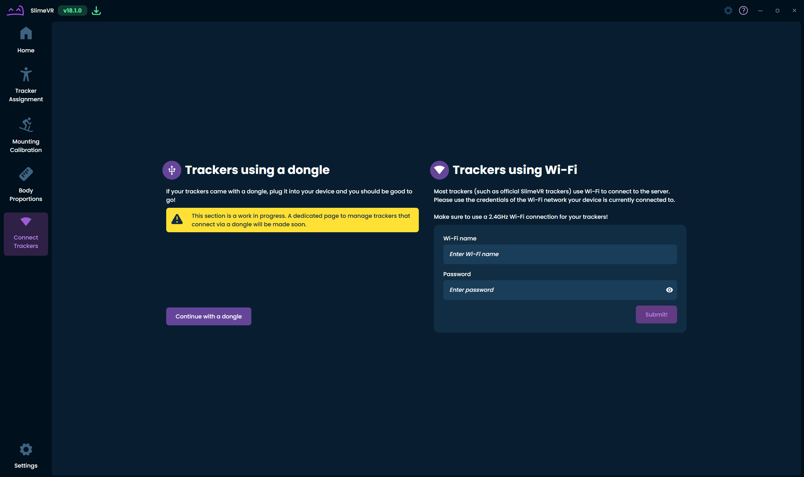
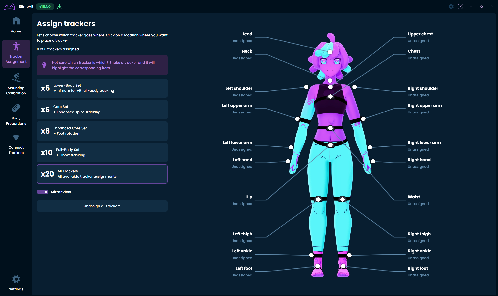
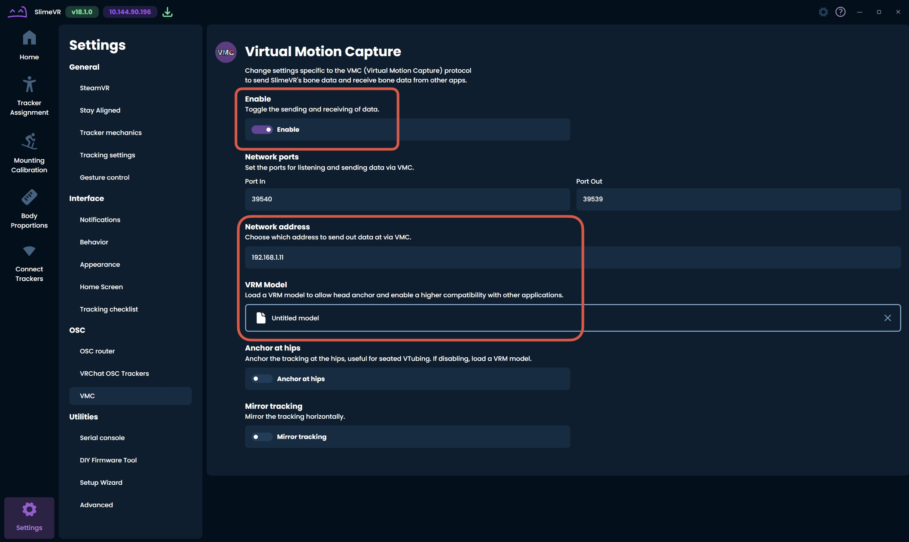

# SlimeVR Setup Guide

This document describes how to set up SlimeVR trackers for the teleoperation pipeline in this repository.

## 1. Get SlimeVR Trackers

You can either buy prebuilt trackers or build trackers yourself. The official documentation is available at [link](https://docs.slimevr.dev/).

## 2. Install SlimeVR Software and Pair Trackers

On your PC, download SlimeVR Server from [link](https://slimevr.dev/), launch it, and pair trackers through either a dongle receiver or Wi-Fi.

## 3. Assign Trackers, Wear Them, and Calibrate

In the **Tracker Assignment** page, assign each tracker to its body location and wear the trackers accordingly. You can choose the tracker count based on your setup, then complete calibration by following the in-app instructions.

## 4. Enable VMC Output

Open **Settings -> OSC -> VMC**, enable VMC output and enter the receiver IP address.

